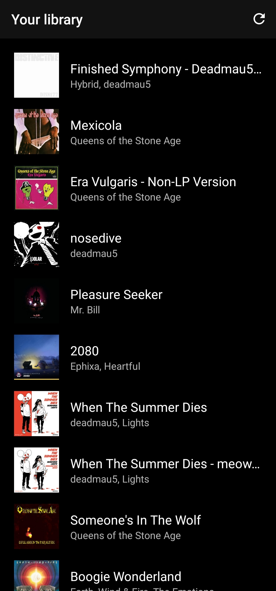
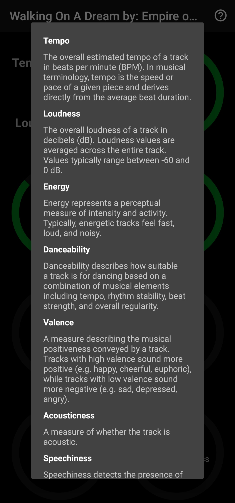
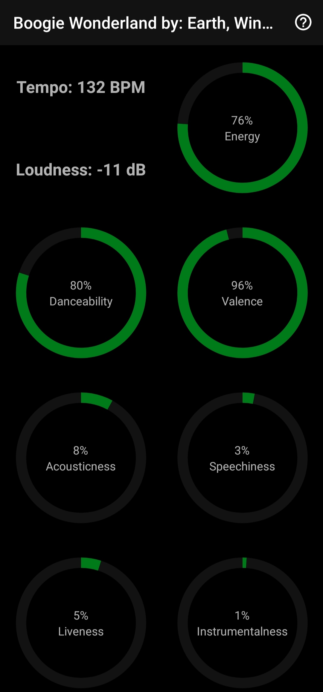
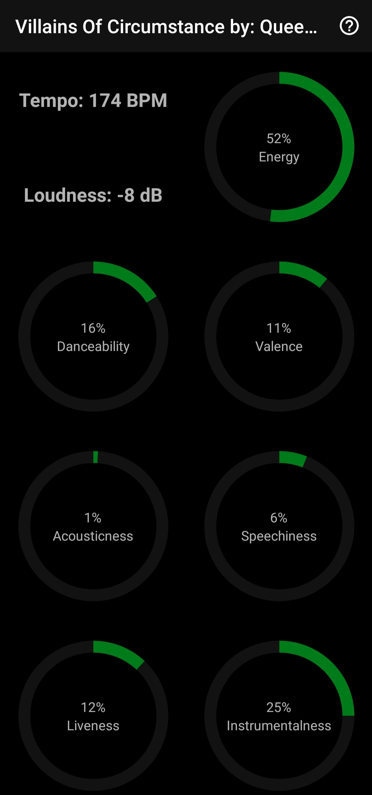
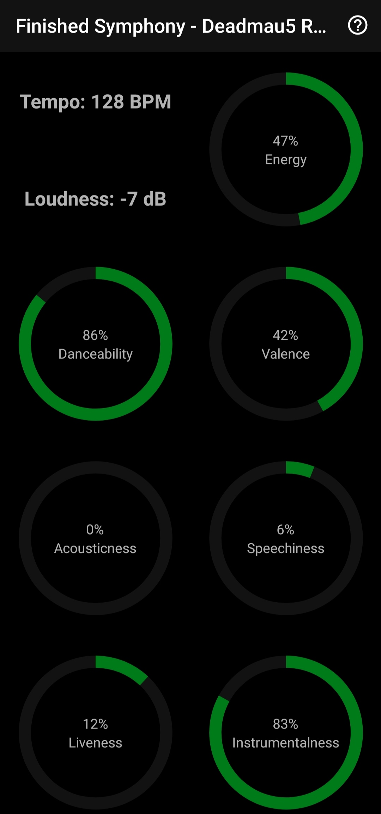

# Spotify Library Features
> *Spotify Library Features* is an Android application that lets You inspect Your Spotify library even more than before with audio features for each song!

## General info
Each track on Spotify has additional data available that can not be accessed directly from the Spotify application. This data describes e.g. how danceable or happy a particular song is. With many more features like these Spotify most likely makes use of them when creating custom playlists that have to conform to e.g. a certain mood or song style.
This application reveals all of this data to You in a convenient way! You can see how Spotify algorithms evaluated Your favourite songs and understand them better with *Spotify Library Features*.

## Screenshots
<p>
	
	
	
	
	
	
</p>

## Setup
In order for more people to download the ready application Spotify requires an API request quota extension which is not granted to hobby projects.
In that case anyone who wants to use the application has to build it themselves while providing their own `Client ID` to the application code.
#### Guide
* Clone the github repository to a desired destination and open the project (preferably) in *Android Studio*:
```git clone https://github.com/sweakpl/spotify-library-features-android.git```
* In order to obtain a `Client ID` register the application in the [Spotify Dashboard](https://developer.spotify.com/dashboard/applications)
	* Refer to the [Spotify Android SDK Quick Start Guide](https://developer.spotify.com/documentation/android/quick-start/#prepare-your-environment) when registering the application.
* In the project - put Your `Client ID` in the file `AuthorizationFlow.kt`:
	* Navigate to `app/src/main/java/com/sweak/spotifylibraryfeatures/features/login/AuthorizationFlow.kt`,
	* In the class `AuthorizationFlow` find a `companion object` and change the `CLIENT_ID` value to Your `Client ID`.
* Build the project (debug configuration) and install on Your device.
* If You have no way of building the project and want to use the application, contact me at *sweakpolska@gmail.com*.

## Icons attribution
* Icons made by [Freepik](https://www.freepik.com) from [Flaticon](https://www.flaticon.com)
* Icons made by [Kiranshastry](https://www.flaticon.com/authors/kiranshastry) from [Flaticon](https://www.flaticon.com)
* Icons made by [Pixel perfect](https://www.flaticon.com/authors/pixel-perfect) from [Flaticon](https://www.flaticon.com)